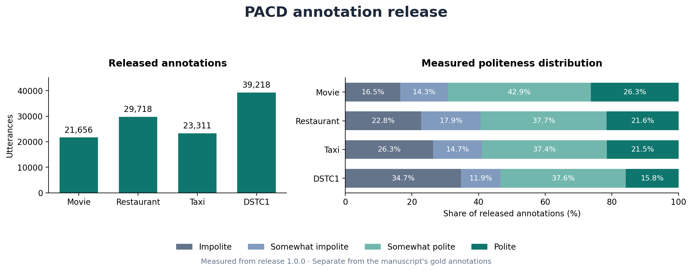
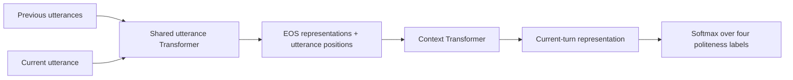
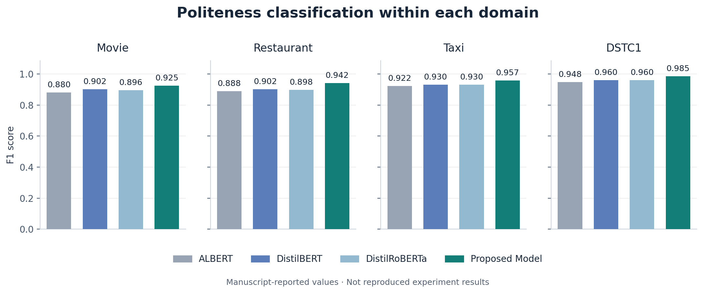
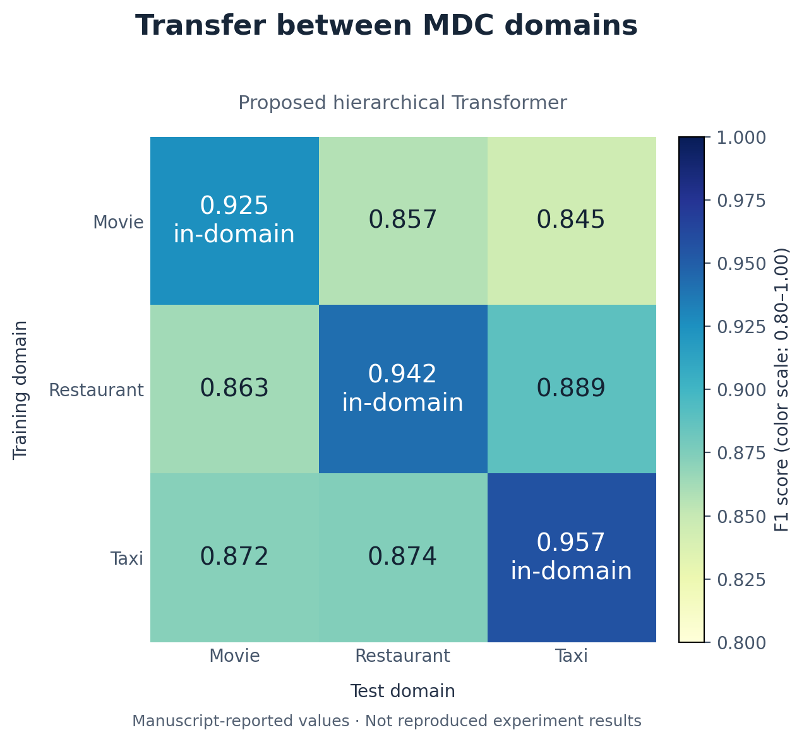
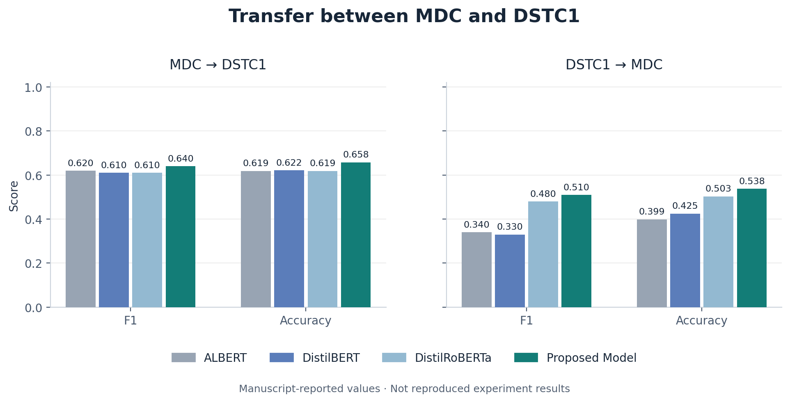
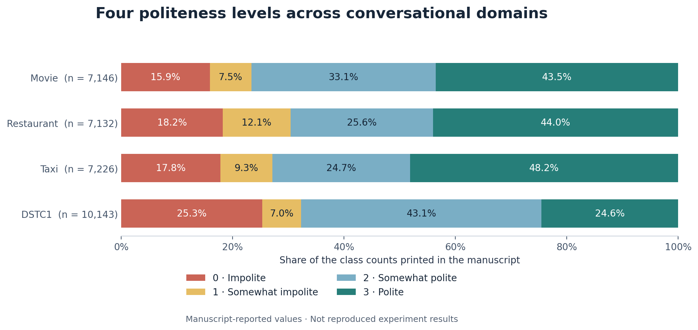

# PACD

**Politeness Annotated Conversational Data**

Research code and data resources for **[Predicting Politeness Variations in Goal-Oriented Conversations](https://doi.org/10.1109/TCSS.2022.3156580)**, by **Kshitij Mishra, Mauajama Firdaus, and Asif Ekbal**. *IEEE Transactions on Computational Social Systems*, 10(3), 1095–1104, 2023.

[Dataset](datasets/README.md) · [Experiments](docs/reproduction.md) · [All reported results](docs/results/README.md) · [Citation](CITATION.bib)

PACD studies how politeness changes across turns in goal-oriented dialogue. The task assigns one of four politeness levels to each utterance, using the preceding conversation as context. It covers movie, restaurant, and taxi conversations from the Microsoft Dialogue Challenge (MDC), and bus-information conversations from DSTC1.

This repository provides a configurable hierarchical Transformer, ALBERT/DistilBERT/DistilRoBERTa baselines, training and evaluation commands, and a new annotation release. This release is distinct from the original manually annotated gold data described in the paper. The manuscript-results sections contain **paper-reported values**. Benchmark reproduction has not been established.

## Annotation release

The repository includes **113,903 annotated utterances** as source identifiers, labels, and dialogue-disjoint splits. A **31,647-utterance subset** matches the manuscript's printed class counts exactly across all four domains. The [dataset card](datasets/README.md) documents measured distributions, source terms, and local text reconstruction.

| Domain | Full annotations | Manuscript-count subset |
| --- | ---: | ---: |
| Movie | 21,656 | 7,146 |
| Restaurant | 29,718 | 7,132 |
| Taxi | 23,311 | 7,226 |
| DSTC1 | 39,218 | 10,143 |



## The task

| ID | Label | Interpretation in the paper |
| --- | --- | --- |
| 0 | `impolite` | Direct or low-politeness wording |
| 1 | `somewhat_impolite` | Limited mitigation of a request |
| 2 | `somewhat_polite` | Polite phrasing with contextual sensitivity |
| 3 | `polite` | More explicitly courteous or indirect phrasing |

Speaker role and dialogue history matter: the paper discusses how similar request forms can receive different labels in user and agent turns. These labels describe perceived politeness in the studied setting; the paper does not model differences in culture, age, social power, or individual preferences.

## Method

The hierarchical model first encodes words within each utterance, then encodes the sequence of utterance representations. A classifier predicts politeness from the context-sensitive representation of the current turn.



The implementation follows the paper's GloVe-compatible word embeddings, sinusoidal positions, utterance-level EOS pooling, context encoder, and cross-entropy objective. Configuration files make the remaining architecture choices explicit. The manuscript also describes a BERT-based configuration without reconciling it with the GloVe formulation; see the [implementation notes](docs/reproduction.md) before comparing scores.

## Get started

Use Python 3.10 or newer. Install the core model:

```bash
git clone git@github.com:Mishrakshitij/PACD.git
cd PACD
python -m venv .venv
source .venv/bin/activate
python -m pip install -e .
```

For the pretrained baselines, install the additional dependencies:

```bash
python -m pip install -e '.[baselines]'
```

### Prepare the data

Follow the [dataset card](datasets/README.md) to obtain the source corpora and review the release contents. MDC utterance text must be acquired from its original source under its license. The supplied source identifiers and labels can then be joined to the local dialogue files:

```bash
python scripts/build_dataset.py --source-dir .local --output-dir .local/data --selection paper
```

This command selects the subset with manuscript-matching class counts. Use `--selection full` for every released annotation. The directory layout is documented in the dataset card. It creates local CSV files containing utterance text, preceding context, labels, and train/validation/test assignments. The source data and hydrated files stay outside the tracked release.

### Train and evaluate

Train the hierarchical model on movie conversations. Add `--glove /path/to/glove.txt` to initialize GloVe embeddings; otherwise word embeddings start from random values:

```bash
python -m pacd train \
  --data .local/data/movie.csv \
  --config configs/hierarchical.json \
  --output runs/movie

python -m pacd evaluate \
  --data .local/data/movie.csv \
  --checkpoint runs/movie/best.pt \
  --split test \
  --output runs/movie/test.json
```

For cross-domain evaluation, use the same checkpoint with a different test domain:

```bash
python -m pacd evaluate \
  --data .local/data/restaurant.csv \
  --checkpoint runs/movie/best.pt \
  --split test \
  --output runs/movie/restaurant.json
```

The baseline selectors are `--model albert`, `--model distilbert`, and `--model distilroberta`. See [Experiments](docs/reproduction.md) for GloVe initialization, combined MDC training, five-fold evaluation, metric definitions, and configuration choices.

### Predict a turn

```bash
python -m pacd predict \
  --checkpoint runs/movie/best.pt \
  --text 'Could you help me, please?' \
  --context '[{"turn_id":0,"speaker":"agent","text":"How can I help?"}]'
```

Prediction requires a checkpoint produced by training. The example shows the input format; it does not assert a model prediction.

## Results reported in the manuscript

### In-domain classification



| Model | Movie F1 | Restaurant F1 | Taxi F1 | DSTC1 F1 |
| --- | ---: | ---: | ---: | ---: |
| ALBERT | 0.880 | 0.888 | 0.922 | 0.948 |
| DistilBERT | 0.902 | 0.902 | 0.930 | 0.960 |
| DistilRoBERTa | 0.896 | 0.898 | 0.930 | 0.960 |
| **Proposed model** | **0.925** | **0.942** | **0.957** | **0.985** |

The proposed model has the highest reported F1 in all four settings. The manuscript also reports geometric mean (GM), index-balanced accuracy (IBA), and accuracy; all values are preserved in the [complete tables](docs/results/README.md).

### Domain transfer



Cross-dataset transfer is more difficult in the reported experiments. The proposed model obtains F1 **0.640** and accuracy **0.658** when trained on MDC and evaluated on DSTC1; the reverse direction gives F1 **0.510** and accuracy **0.538**.



## Dataset statistics reported in the manuscript

These are the paper's counts. Actual released annotation counts and provenance are documented separately in the [dataset card](datasets/README.md).

| Domain | Phase 1 | Phase 2 | Train | Test | Validation |
| --- | ---: | ---: | ---: | ---: | ---: |
| Movie | 21,656 | 7,146 | 5,002 | 1,394 | 750 |
| Restaurant | 29,720 | 7,133 | 4,993 | 1,391 | 749 |
| Taxi | 23,311 | 7,226 | 5,058 | 1,409 | 759 |
| DSTC1 | 23,311 | 10,144 | 7,101 | 2,028 | 1,015 |



The restaurant and DSTC1 class-count totals are each one lower than their Phase 2 totals. The plot uses the class-count totals as printed. The manuscript's DSTC1 split counts also differ from its stated split percentages. These discrepancies are recorded in the [reproduction notes](docs/reproduction.md#manuscript-ambiguities); no reported count is silently changed.

## Tables and figures

All 48 classification rows, 60 tabulated hyperparameter configurations, and dataset statistics are available as CSV files in [docs/results](docs/results/README.md). The figures are available as PNG and SVG, including the [annotation-phase comparison](docs/figures/annotation_phases.png), [proposed-model](docs/figures/hyperparameters_proposed.png) and [baseline](docs/figures/hyperparameters_baselines.png) validation results.

To regenerate them from the committed tables:

```bash
python -m pip install matplotlib
python scripts/plot_results.py
python scripts/plot_dataset.py
```

For PDF output of the manuscript figures, add `--formats png svg pdf` to `plot_results.py`. Plotting does not train or evaluate a model.

## Citation

```bibtex
@article{mishra2023predicting,
  title = {Predicting Politeness Variations in Goal-Oriented Conversations},
  author = {Mishra, Kshitij and Firdaus, Mauajama and Ekbal, Asif},
  journal = {IEEE Transactions on Computational Social Systems},
  year = {2023},
  volume = {10},
  number = {3},
  pages = {1095--1104},
  doi = {10.1109/TCSS.2022.3156580}
}
```

Please identify the annotation release used when reporting experiments. Source corpora retain their own terms; see [datasets/README.md](datasets/README.md).
