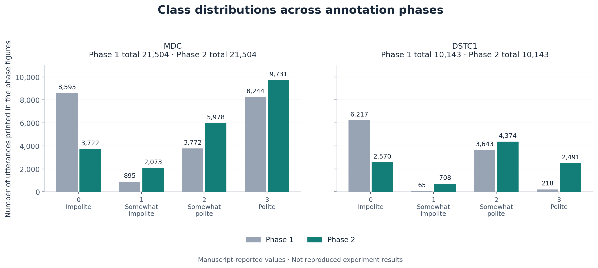
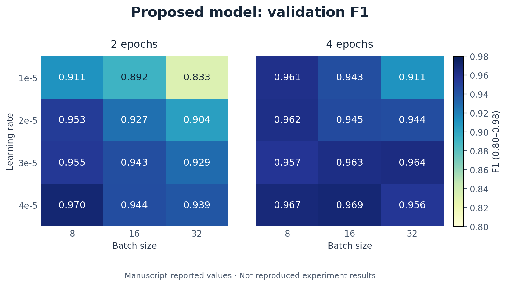
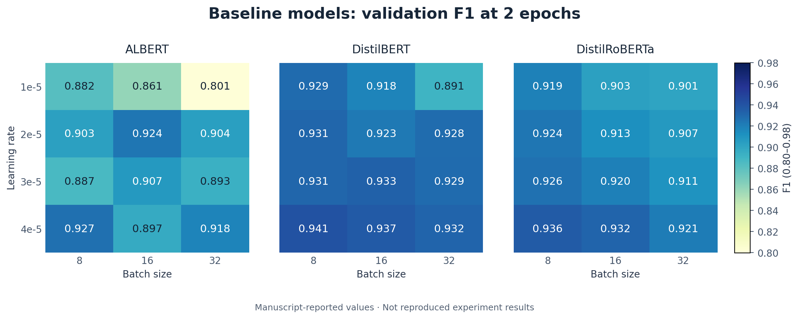

# Results reported in the manuscript

These tables transcribe the manuscript of *[Predicting Politeness Variations in Goal-Oriented Conversations](https://doi.org/10.1109/TCSS.2022.3156580)*. They are **manuscript-reported values, not reproduced results**. They describe the original study and its annotations, not a run of this repository on the new annotation release.

## Machine-readable tables

| File | Contents | Rows |
| --- | --- | ---: |
| [classification.csv](classification.csv) | All in-domain, cross-domain, and cross-dataset F1, GM, IBA, and accuracy values | 48 |
| [hyperparameters.csv](hyperparameters.csv) | Every printed learning-rate, batch-size, and epoch configuration, including losses | 60 |
| [dataset_sizes.csv](dataset_sizes.csv) | Phase 1, Phase 2, and fixed split counts | 4 |
| [class_distribution.csv](class_distribution.csv) | Counts for four labels across four domains and combined MDC | 20 |
| [annotation_phases.csv](annotation_phases.csv) | Phase 1 and Phase 2 class counts printed in the MDC and DSTC1 figures | 16 |

Each row includes `source=manuscript` and the corresponding manuscript table or figure identifier. `f1`, `gm`, and `iba` preserve the metric names printed in the manuscript; their averaging conventions are unspecified. No confidence intervals or additional experimental runs are inferred.

## Classification

The manuscript reports five-fold average scores. Its relationship between cross-validation and the fixed split table is unspecified; see [reproduction notes](../reproduction.md#manuscript-ambiguities). GM denotes geometric mean, IBA index-balanced accuracy, and accuracy is the fraction of correct predictions.

### In-domain

**Movie**

| Model | F1 | GM | IBA | Accuracy |
| --- | ---: | ---: | ---: | ---: |
| ALBERT | 0.880 | 0.914 | 0.832 | 0.881 |
| DistilBERT | 0.902 | 0.930 | 0.862 | 0.902 |
| DistilRoBERTa | 0.896 | 0.926 | 0.856 | 0.896 |
| **Proposed Model** | **0.925** | **0.951** | **0.884** | **0.927** |

**Restaurant**

| Model | F1 | GM | IBA | Accuracy |
| --- | ---: | ---: | ---: | ---: |
| ALBERT | 0.888 | 0.920 | 0.844 | 0.887 |
| DistilBERT | 0.902 | 0.932 | 0.866 | 0.902 |
| DistilRoBERTa | 0.898 | 0.930 | 0.862 | 0.902 |
| **Proposed Model** | **0.942** | **0.958** | **0.891** | **0.938** |

**Taxi**

| Model | F1 | GM | IBA | Accuracy |
| --- | ---: | ---: | ---: | ---: |
| ALBERT | 0.922 | 0.946 | 0.892 | 0.923 |
| DistilBERT | 0.930 | 0.952 | 0.902 | 0.931 |
| DistilRoBERTa | 0.930 | 0.950 | 0.902 | 0.930 |
| **Proposed Model** | **0.957** | **0.978** | **0.923** | **0.957** |

**DSTC1**

| Model | F1 | GM | IBA | Accuracy |
| --- | ---: | ---: | ---: | ---: |
| ALBERT | 0.948 | 0.962 | 0.928 | 0.951 |
| DistilBERT | 0.960 | 0.970 | 0.934 | 0.960 |
| DistilRoBERTa | 0.960 | 0.970 | 0.936 | 0.959 |
| **Proposed Model** | **0.985** | **0.989** | **0.950** | **0.981** |

### Cross-domain within MDC

**Movie → Restaurant**

| Model | F1 | GM | IBA | Accuracy |
| --- | ---: | ---: | ---: | ---: |
| ALBERT | 0.810 | 0.870 | 0.760 | 0.817 |
| DistilBERT | 0.830 | 0.890 | 0.790 | 0.841 |
| DistilRoBERTa | 0.830 | 0.880 | 0.780 | 0.832 |
| **Proposed Model** | **0.857** | **0.914** | **0.817** | **0.867** |

**Movie → Taxi**

| Model | F1 | GM | IBA | Accuracy |
| --- | ---: | ---: | ---: | ---: |
| ALBERT | 0.820 | 0.870 | 0.770 | 0.825 |
| DistilBERT | 0.800 | 0.870 | 0.760 | 0.811 |
| DistilRoBERTa | 0.810 | 0.870 | 0.760 | 0.810 |
| **Proposed Model** | **0.845** | **0.891** | **0.798** | **0.854** |

**Restaurant → Movie**

| Model | F1 | GM | IBA | Accuracy |
| --- | ---: | ---: | ---: | ---: |
| ALBERT | 0.840 | 0.890 | 0.780 | 0.843 |
| DistilBERT | 0.840 | 0.880 | 0.780 | 0.842 |
| DistilRoBERTa | 0.830 | 0.870 | 0.760 | 0.835 |
| **Proposed Model** | **0.863** | **0.920** | **0.810** | **0.861** |

**Restaurant → Taxi**

| Model | F1 | GM | IBA | Accuracy |
| --- | ---: | ---: | ---: | ---: |
| ALBERT | 0.850 | 0.890 | 0.800 | 0.843 |
| DistilBERT | 0.850 | 0.890 | 0.800 | 0.847 |
| DistilRoBERTa | 0.870 | 0.910 | 0.830 | 0.870 |
| **Proposed Model** | **0.889** | **0.934** | **0.858** | **0.897** |

**Taxi → Movie**

| Model | F1 | GM | IBA | Accuracy |
| --- | ---: | ---: | ---: | ---: |
| ALBERT | 0.810 | 0.860 | 0.740 | 0.817 |
| DistilBERT | 0.840 | 0.890 | 0.790 | 0.847 |
| DistilRoBERTa | 0.850 | 0.890 | 0.790 | 0.850 |
| **Proposed Model** | **0.872** | **0.913** | **0.815** | **0.871** |

**Taxi → Restaurant**

| Model | F1 | GM | IBA | Accuracy |
| --- | ---: | ---: | ---: | ---: |
| ALBERT | 0.820 | 0.870 | 0.760 | 0.819 |
| DistilBERT | 0.850 | 0.900 | 0.800 | 0.854 |
| DistilRoBERTa | 0.850 | 0.890 | 0.790 | 0.850 |
| **Proposed Model** | **0.874** | **0.923** | **0.838** | **0.879** |

### Cross-dataset

**MDC → DSTC1**

| Model | F1 | GM | IBA | Accuracy |
| --- | ---: | ---: | ---: | ---: |
| ALBERT | 0.620 | 0.700 | 0.490 | 0.619 |
| DistilBERT | 0.610 | 0.680 | 0.470 | 0.622 |
| DistilRoBERTa | 0.610 | 0.690 | 0.480 | 0.619 |
| **Proposed Model** | **0.640** | **0.725** | **0.531** | **0.658** |

**DSTC1 → MDC**

| Model | F1 | GM | IBA | Accuracy |
| --- | ---: | ---: | ---: | ---: |
| ALBERT | 0.340 | 0.460 | 0.240 | 0.399 |
| DistilBERT | 0.330 | 0.450 | 0.270 | 0.425 |
| DistilRoBERTa | 0.480 | 0.600 | 0.370 | 0.503 |
| **Proposed Model** | **0.510** | **0.623** | **0.400** | **0.538** |

## Dataset statistics

### Phase and split sizes

| Domain | Phase 1 | Phase 2 | Train | Test | Validation |
| --- | ---: | ---: | ---: | ---: | ---: |
| Movie | 21,656 | 7,146 | 5,002 | 1,394 | 750 |
| Restaurant | 29,720 | 7,133 | 4,993 | 1,391 | 749 |
| Taxi | 23,311 | 7,226 | 5,058 | 1,409 | 759 |
| DSTC1 | 23,311 | 10,144 | 7,101 | 2,028 | 1,015 |

### Politeness class counts

| Label | Movie | Restaurant | Taxi | DSTC1 | MDC |
| --- | ---: | ---: | ---: | ---: | ---: |
| `impolite` | 1,136 | 1,301 | 1,285 | 2,570 | 3,722 |
| `somewhat_impolite` | 533 | 866 | 674 | 708 | 2,073 |
| `somewhat_polite` | 2,367 | 1,824 | 1,787 | 4,374 | 5,978 |
| `polite` | 3,110 | 3,141 | 3,480 | 2,491 | 9,731 |
| **Sum of class counts** | **7,146** | **7,132** | **7,226** | **10,143** | **21,504** |

Restaurant and DSTC1 class totals are one lower than the corresponding Phase 2 sizes. Combined MDC inherits the restaurant difference. Distribution figures normalize the class counts themselves and show those denominators. See [all discrepancies](../reproduction.md#manuscript-ambiguities).

### Annotation-phase figures

The following values are transcribed from the numeric labels in the manuscript's Phase 1 / Phase 2 figures. They describe the original study's annotation phases, independently of the new release.

| Label | MDC Phase 1 | MDC Phase 2 | DSTC1 Phase 1 | DSTC1 Phase 2 |
| --- | ---: | ---: | ---: | ---: |
| `impolite` | 8,593 | 3,722 | 6,217 | 2,570 |
| `somewhat_impolite` | 895 | 2,073 | 65 | 708 |
| `somewhat_polite` | 3,772 | 5,978 | 3,643 | 4,374 |
| `polite` | 8,244 | 9,731 | 218 | 2,491 |
| **Sum of printed counts** | **21,504** | **21,504** | **10,143** | **10,143** |

The Phase 1 figure totals differ from the Phase 1 size table: the table gives 74,687 MDC utterances across its three domains and 23,311 DSTC1 utterances. The figures do not specify the subset or scope that accounts for this difference. These values are preserved separately; no explanation or missing instances are inferred. Phase 2 figure counts agree with the class-distribution table, including its one-instance differences from the Phase 2 size table.

The graph compares marginal class counts. Individual utterance-level label transitions cannot be recovered from these totals. The four domain pie charts agree with the class-distribution table after rounding percentages to two decimal places.

## Hyperparameter search

The manuscript prints 24 proposed-model configurations across 2 and 4 epochs, and 36 baseline configurations at 2 epochs. The mentioned 3-epoch results are not tabulated. Values below retain the printed precision, including unusual loss values.

### Proposed Model

| Epochs | Learning rate | Batch size | Train loss | Validation loss | F1 |
| ---: | ---: | ---: | ---: | ---: | ---: |
| 2 | 1e-5 | 8 | 0.0799 | 0.44889 | 0.911 |
| 2 | 1e-5 | 16 | 0.376 | 0.4756 | 0.892 |
| 2 | 1e-5 | 32 | 0.4143 | 0.5136 | 0.833 |
| 2 | 2e-5 | 8 | 0.0937 | 0.42237 | 0.953 |
| 2 | 2e-5 | 16 | 0.21 | 0.4098 | 0.927 |
| 2 | 2e-5 | 32 | 0.3314 | 0.45085 | 0.904 |
| 2 | 3e-5 | 8 | 0.0606 | 0.432 | 0.955 |
| 2 | 3e-5 | 16 | 0.1253 | 0.39881 | 0.943 |
| 2 | 3e-5 | 32 | 0.8487 | 0.4082 | 0.929 |
| 2 | 4e-5 | 8 | 2.2619 | 0.4308 | 0.970 |
| 2 | 4e-5 | 16 | 0.1801 | 0.3913 | 0.944 |
| 2 | 4e-5 | 32 | 0.4385 | 0.3809 | 0.939 |
| 4 | 1e-5 | 8 | 0.7722 | 0.443 | 0.961 |
| 4 | 1e-5 | 16 | 0.5304 | 0.4013 | 0.943 |
| 4 | 1e-5 | 32 | 0.387 | 0.4374 | 0.911 |
| 4 | 2e-5 | 8 | 0.0033 | 0.484 | 0.962 |
| 4 | 2e-5 | 16 | 0.0146 | 0.403 | 0.945 |
| 4 | 2e-5 | 32 | 0.2159 | 0.3956 | 0.944 |
| 4 | 3e-5 | 8 | 0.0012 | 0.5133 | 0.957 |
| 4 | 3e-5 | 16 | 0.2812 | 0.4089 | 0.963 |
| 4 | 3e-5 | 32 | 0.0978 | 0.3814 | 0.964 |
| 4 | 4e-5 | 8 | 0.0009 | 0.5039 | 0.967 |
| 4 | 4e-5 | 16 | 0.4161 | 0.4353 | 0.969 |
| 4 | 4e-5 | 32 | 0.2902 | 0.4082 | 0.956 |

### ALBERT

| Epochs | Learning rate | Batch size | Train loss | Validation loss | F1 |
| ---: | ---: | ---: | ---: | ---: | ---: |
| 2 | 1e-5 | 8 | 0.1782 | 0.5216 | 0.882 |
| 2 | 1e-5 | 16 | 0.4324 | 0.5869 | 0.861 |
| 2 | 1e-5 | 32 | 0.5627 | 0.8912 | 0.801 |
| 2 | 2e-5 | 8 | 0.3952 | 0.6354 | 0.903 |
| 2 | 2e-5 | 16 | 0.6542 | 0.9657 | 0.924 |
| 2 | 2e-5 | 32 | 1.279 | 0.8612 | 0.904 |
| 2 | 3e-5 | 8 | 0.2735 | 0.7162 | 0.887 |
| 2 | 3e-5 | 16 | 0.4613 | 0.9712 | 0.907 |
| 2 | 3e-5 | 32 | 0.4345 | 0.9265 | 0.893 |
| 2 | 4e-5 | 8 | 0.9813 | 0.9012 | 0.927 |
| 2 | 4e-5 | 16 | 0.4965 | 0.6148 | 0.897 |
| 2 | 4e-5 | 32 | 0.6472 | 0.6581 | 0.918 |

### DistilBERT

| Epochs | Learning rate | Batch size | Train loss | Validation loss | F1 |
| ---: | ---: | ---: | ---: | ---: | ---: |
| 2 | 1e-5 | 8 | 0.8736 | 0.8931 | 0.929 |
| 2 | 1e-5 | 16 | 0.8512 | 0.8265 | 0.918 |
| 2 | 1e-5 | 32 | 0.9365 | 0.9642 | 0.891 |
| 2 | 2e-5 | 8 | 0.4153 | 0.695 | 0.931 |
| 2 | 2e-5 | 16 | 0.4169 | 0.6420 | 0.923 |
| 2 | 2e-5 | 32 | 0.4621 | 0.5421 | 0.928 |
| 2 | 3e-5 | 8 | 0.2637 | 0.4421 | 0.931 |
| 2 | 3e-5 | 16 | 0.3627 | 0.4265 | 0.933 |
| 2 | 3e-5 | 32 | 0.3643 | 0.4374 | 0.929 |
| 2 | 4e-5 | 8 | 0.2398 | 0.3125 | 0.941 |
| 2 | 4e-5 | 16 | 0.4331 | 0.5162 | 0.937 |
| 2 | 4e-5 | 32 | 0.4919 | 0.5638 | 0.932 |

### DistilRoBERTa

| Epochs | Learning rate | Batch size | Train loss | Validation loss | F1 |
| ---: | ---: | ---: | ---: | ---: | ---: |
| 2 | 1e-5 | 8 | 0.7721 | 0.8231 | 0.919 |
| 2 | 1e-5 | 16 | 0.9367 | 0.9832 | 0.903 |
| 2 | 1e-5 | 32 | 1.0334 | 1.2691 | 0.901 |
| 2 | 2e-5 | 8 | 0.6393 | 0.7369 | 0.924 |
| 2 | 2e-5 | 16 | 0.4438 | 0.5169 | 0.913 |
| 2 | 2e-5 | 32 | 0.3947 | 0.6268 | 0.907 |
| 2 | 3e-5 | 8 | 0.3785 | 0.4217 | 0.926 |
| 2 | 3e-5 | 16 | 0.4161 | 0.6717 | 0.920 |
| 2 | 3e-5 | 32 | 0.5728 | 0.7414 | 0.911 |
| 2 | 4e-5 | 8 | 0.3782 | 0.4003 | 0.936 |
| 2 | 4e-5 | 16 | 0.4725 | 0.4924 | 0.932 |
| 2 | 4e-5 | 32 | 0.5726 | 0.6647 | 0.921 |

## Figure files

| Figure | PNG | SVG |
| --- | --- | --- |
| In-domain F1 | [PNG](../figures/in_domain_f1.png) | [SVG](../figures/in_domain_f1.svg) |
| Class distribution | [PNG](../figures/class_distribution.png) | [SVG](../figures/class_distribution.svg) |
| Annotation-phase class counts | [PNG](../figures/annotation_phases.png) | [SVG](../figures/annotation_phases.svg) |
| MDC domain transfer | [PNG](../figures/cross_domain_f1.png) | [SVG](../figures/cross_domain_f1.svg) |
| MDC / DSTC1 transfer | [PNG](../figures/cross_dataset.png) | [SVG](../figures/cross_dataset.svg) |
| Proposed-model validation F1 | [PNG](../figures/hyperparameters_proposed.png) | [SVG](../figures/hyperparameters_proposed.svg) |
| Baseline validation F1 | [PNG](../figures/hyperparameters_baselines.png) | [SVG](../figures/hyperparameters_baselines.svg) |

Regenerate the figures using `python scripts/plot_results.py` from the repository root. Add `--formats png svg pdf` for PDF export. The script plots these tables; it does not train classifiers.
